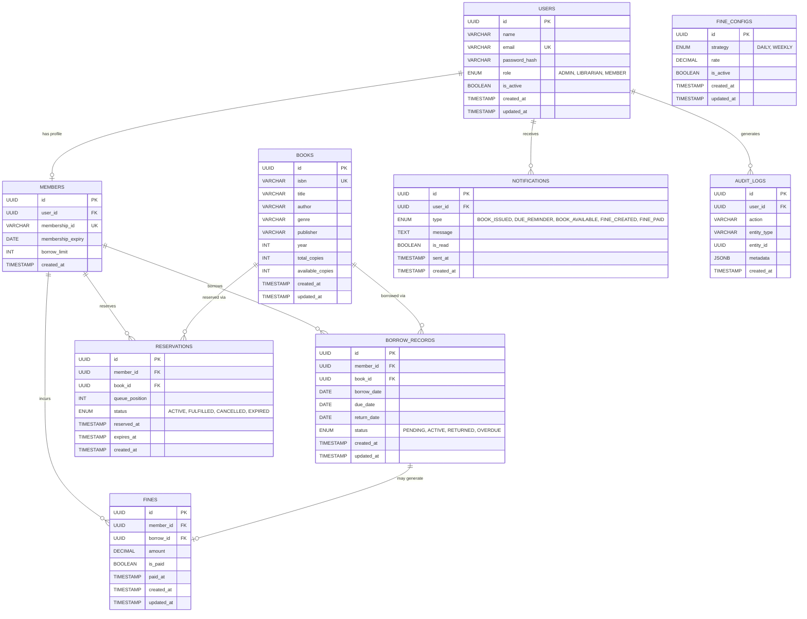

# ER Diagram — Library-Lite

## Overview

The ER Diagram shows all database tables, their columns (with data types and constraints), and the relationships between them for the Library-Lite system.

---

## ER Diagram (Mermaid)

---

## Table Descriptions

### `users`
Central authentication table. Stores all users regardless of role.

| Column | Type | Constraint | Description |
|---|---|---|---|
| `id` | UUID | PK | Auto-generated primary key |
| `name` | VARCHAR(100) | NOT NULL | Full name |
| `email` | VARCHAR(255) | UNIQUE, NOT NULL | Login email |
| `password_hash` | VARCHAR(255) | NOT NULL | bcrypt hashed password |
| `role` | ENUM | NOT NULL | `ADMIN`, `LIBRARIAN`, `MEMBER` |
| `is_active` | BOOLEAN | DEFAULT true | Soft-disable accounts |
| `created_at` | TIMESTAMP | DEFAULT NOW() | Record creation time |
| `updated_at` | TIMESTAMP | AUTO UPDATE | Last update time |

---

### `members`
Extended profile for users with role `MEMBER`.

| Column | Type | Constraint | Description |
|---|---|---|---|
| `id` | UUID | PK | Primary key |
| `user_id` | UUID | FK → users.id | One-to-one with users |
| `membership_id` | VARCHAR(20) | UNIQUE | Library card number |
| `membership_expiry` | DATE | NOT NULL | Membership validity |
| `borrow_limit` | INT | DEFAULT 3 | Max books allowed at once |

---

### `books`
Book catalog with copy tracking.

| Column | Type | Constraint | Description |
|---|---|---|---|
| `id` | UUID | PK | Primary key |
| `isbn` | VARCHAR(20) | UNIQUE, NOT NULL | International book number |
| `title` | VARCHAR(255) | NOT NULL | Book title |
| `author` | VARCHAR(100) | NOT NULL | Author name |
| `genre` | VARCHAR(50) | | Genre/category |
| `publisher` | VARCHAR(100) | | Publisher name |
| `year` | INT | | Publication year |
| `total_copies` | INT | DEFAULT 1 | Total physical copies |
| `available_copies` | INT | DEFAULT 1 | Currently available copies |

---

### `borrow_records`
Tracks all book borrowing activity.

| Column | Type | Constraint | Description |
|---|---|---|---|
| `id` | UUID | PK | Primary key |
| `member_id` | UUID | FK → members.id | Borrowing member |
| `book_id` | UUID | FK → books.id | Borrowed book |
| `borrow_date` | DATE | NOT NULL | Date issued |
| `due_date` | DATE | NOT NULL | Return deadline |
| `return_date` | DATE | NULLABLE | Actual return date |
| `status` | ENUM | NOT NULL | `PENDING`, `ACTIVE`, `RETURNED`, `OVERDUE` |

---

### `reservations`
Queue-based reservation system for unavailable books.

| Column | Type | Constraint | Description |
|---|---|---|---|
| `id` | UUID | PK | Primary key |
| `member_id` | UUID | FK → members.id | Reserving member |
| `book_id` | UUID | FK → books.id | Reserved book |
| `queue_position` | INT | NOT NULL | Position in queue |
| `status` | ENUM | NOT NULL | `ACTIVE`, `FULFILLED`, `CANCELLED`, `EXPIRED` |
| `reserved_at` | TIMESTAMP | DEFAULT NOW() | When reservation was made |
| `expires_at` | TIMESTAMP | NOT NULL | Auto-expire if not claimed |

---

### `fines`
Tracks overdue fines per borrow record.

| Column | Type | Constraint | Description |
|---|---|---|---|
| `id` | UUID | PK | Primary key |
| `member_id` | UUID | FK → members.id | Member who owes fine |
| `borrow_id` | UUID | FK → borrow_records.id | Related borrow |
| `amount` | DECIMAL(10,2) | NOT NULL | Fine amount in ₹ |
| `is_paid` | BOOLEAN | DEFAULT false | Payment status |
| `paid_at` | TIMESTAMP | NULLABLE | When fine was paid |

---

### `notifications`
In-app and email notification log.

| Column | Type | Constraint | Description |
|---|---|---|---|
| `id` | UUID | PK | Primary key |
| `user_id` | UUID | FK → users.id | Recipient user |
| `type` | ENUM | NOT NULL | Notification category |
| `message` | TEXT | NOT NULL | Notification content |
| `is_read` | BOOLEAN | DEFAULT false | Read status |
| `sent_at` | TIMESTAMP | DEFAULT NOW() | When sent |

---

### `fine_configs`
Configurable fine rules (managed by Admin).

| Column | Type | Constraint | Description |
|---|---|---|---|
| `id` | UUID | PK | Primary key |
| `strategy` | ENUM | NOT NULL | `DAILY` or `WEEKLY` |
| `rate` | DECIMAL(10,2) | NOT NULL | Rate per day/week |
| `is_active` | BOOLEAN | DEFAULT true | Active rule flag |

---

### `audit_logs`
Immutable log of all significant actions for traceability.

| Column | Type | Constraint | Description |
|---|---|---|---|
| `id` | UUID | PK | Primary key |
| `user_id` | UUID | FK → users.id | Actor |
| `action` | VARCHAR(100) | NOT NULL | e.g., `BOOK_ISSUED`, `FINE_PAID` |
| `entity_type` | VARCHAR(50) | NOT NULL | e.g., `Book`, `BorrowRecord` |
| `entity_id` | UUID | NOT NULL | ID of affected entity |
| `metadata` | JSONB | | Additional context |

---

## Relationship Summary

| Relationship | Cardinality | Description |
|---|---|---|
| `users` → `members` | 1 : 0..1 | One user can have one member profile |
| `members` → `borrow_records` | 1 : 0..N | Member can have many borrows |
| `books` → `borrow_records` | 1 : 0..N | Book can be borrowed many times |
| `members` → `reservations` | 1 : 0..N | Member can reserve multiple books |
| `books` → `reservations` | 1 : 0..N | Book can have a queue of reservations |
| `borrow_records` → `fines` | 1 : 0..1 | One borrow can generate at most one fine |
| `members` → `fines` | 1 : 0..N | Member can accumulate multiple fines |
| `users` → `notifications` | 1 : 0..N | User receives many notifications |
| `users` → `audit_logs` | 1 : 0..N | User generates many audit log entries |
