# Class Diagram — Library-Lite

## Overview

The class diagram shows the major classes in the Library-Lite backend, their attributes, methods, and relationships. The design follows OOP principles: **encapsulation**, **abstraction**, **inheritance**, and **polymorphism**.

---

## Class Diagram (Mermaid)

```mermaid
classDiagram

    %% ─── Abstract Base / Interfaces ───────────────────────────────────────────

    class BaseEntity {
        <<abstract>>
        +String id
        +Date createdAt
        +Date updatedAt
        +validate()* void
    }

    class IRepository~T~ {
        <<interface>>
        +findById(id: String) T
        +findAll() T[]
        +save(entity: T) T
        +update(id: String, data: Partial~T~) T
        +delete(id: String) void
    }

    class INotificationStrategy {
        <<interface>>
        +send(recipient: String, subject: String, body: String) void
    }

    class IFineStrategy {
        <<interface>>
        +calculate(dueDate: Date, returnDate: Date) Float
    }

    %% ─── User Hierarchy ────────────────────────────────────────────────────────

    class User {
        +String id
        +String name
        +String email
        +String passwordHash
        +UserRole role
        +Boolean isActive
        +Date createdAt
        +login(email: String, password: String) String
        +logout() void
        +updateProfile(data: UserUpdateDTO) void
        +validate() void
    }

    class Member {
        +String membershipId
        +Date membershipExpiry
        +Int borrowLimit
        +borrowBook(bookId: String) BorrowRecord
        +returnBook(borrowId: String) void
        +reserveBook(bookId: String) Reservation
        +cancelReservation(reservationId: String) void
        +viewFines() Fine[]
        +hasOutstandingFines() Boolean
    }

    class Librarian {
        +String staffId
        +String department
        +issueBook(memberId: String, bookId: String) BorrowRecord
        +processReturn(borrowId: String) void
        +markFinePaid(fineId: String) void
        +searchMembers(query: String) Member[]
    }

    class Admin {
        +manageUsers() User[]
        +assignRole(userId: String, role: UserRole) void
        +generateReport(type: ReportType) Report
        +configureFineRules(rules: FineConfig) void
        +deleteBook(bookId: String) void
    }

    %% ─── Book ──────────────────────────────────────────────────────────────────

    class Book {
        +String id
        +String isbn
        +String title
        +String author
        +String genre
        +String publisher
        +Int year
        +Int totalCopies
        +Int availableCopies
        +Boolean isAvailable()
        +reserve() void
        +release() void
        +validate() void
    }

    %% ─── Borrow Record ─────────────────────────────────────────────────────────

    class BorrowRecord {
        +String id
        +String memberId
        +String bookId
        +Date borrowDate
        +Date dueDate
        +Date returnDate
        +BorrowStatus status
        +isOverdue() Boolean
        +getDaysOverdue() Int
        +validate() void
    }

    %% ─── Reservation ───────────────────────────────────────────────────────────

    class Reservation {
        +String id
        +String memberId
        +String bookId
        +Date reservedAt
        +Date expiresAt
        +ReservationStatus status
        +cancel() void
        +fulfill() void
        +isExpired() Boolean
    }

    %% ─── Fine ──────────────────────────────────────────────────────────────────

    class Fine {
        +String id
        +String memberId
        +String borrowId
        +Float amount
        +Boolean isPaid
        +Date paidAt
        +markAsPaid() void
        +validate() void
    }

    %% ─── Services ──────────────────────────────────────────────────────────────

    class AuthService {
        -UserRepository userRepo
        +login(email: String, password: String) AuthToken
        +register(data: RegisterDTO) User
        +verifyToken(token: String) JWTPayload
        +hashPassword(password: String) String
        +refreshToken(token: String) AuthToken
    }

    class BookService {
        -BookRepository bookRepo
        +getBooks(filters: BookFilter) PagedResult~Book~
        +getBookById(id: String) Book
        +createBook(data: CreateBookDTO) Book
        +updateBook(id: String, data: UpdateBookDTO) Book
        +deleteBook(id: String) void
        +searchBooks(query: String) Book[]
    }

    class BorrowService {
        -BorrowRepository borrowRepo
        -BookRepository bookRepo
        -FineService fineService
        -NotificationService notificationService
        +requestBorrow(memberId: String, bookId: String) BorrowRecord
        +issueBook(borrowId: String) BorrowRecord
        +processReturn(borrowId: String) void
        +getActiveBorrows(memberId: String) BorrowRecord[]
        +getPendingRequests() BorrowRecord[]
    }

    class FineService {
        -FineRepository fineRepo
        -IFineStrategy fineStrategy
        +calculateFine(borrowRecord: BorrowRecord) Float
        +createFine(memberId: String, borrowId: String, amount: Float) Fine
        +markAsPaid(fineId: String) void
        +getMemberFines(memberId: String) Fine[]
        +hasOutstandingFines(memberId: String) Boolean
    }

    class ReservationService {
        -ReservationRepository reservationRepo
        -NotificationService notificationService
        +createReservation(memberId: String, bookId: String) Reservation
        +cancelReservation(id: String) void
        +getNextInQueue(bookId: String) Reservation
        +notifyNextMember(bookId: String) void
        +expireOldReservations() void
    }

    class NotificationService {
        -INotificationStrategy strategy
        +notify(event: NotificationEvent) void
        +sendBookIssued(member: Member, book: Book) void
        +sendDueDateReminder(member: Member, borrow: BorrowRecord) void
        +sendFineCreated(member: Member, fine: Fine) void
        +sendBookAvailable(member: Member, book: Book) void
    }

    %% ─── Fine Strategies (Strategy Pattern) ────────────────────────────────────

    class DailyFineStrategy {
        -Float ratePerDay
        +calculate(dueDate: Date, returnDate: Date) Float
    }

    class WeeklyFineStrategy {
        -Float ratePerWeek
        +calculate(dueDate: Date, returnDate: Date) Float
    }

    %% ─── Notification Strategies ───────────────────────────────────────────────

    class EmailNotificationStrategy {
        -String smtpHost
        -String smtpPort
        +send(recipient: String, subject: String, body: String) void
    }

    class InAppNotificationStrategy {
        +send(recipient: String, subject: String, body: String) void
    }

    %% ─── Repositories ──────────────────────────────────────────────────────────

    class UserRepository {
        +findByEmail(email: String) User
        +findById(id: String) User
        +findAll() User[]
        +save(user: User) User
        +update(id: String, data: Partial~User~) User
        +delete(id: String) void
    }

    class BookRepository {
        +findByISBN(isbn: String) Book
        +findById(id: String) Book
        +findAll() Book[]
        +save(book: Book) Book
        +update(id: String, data: Partial~Book~) Book
        +delete(id: String) void
    }

    class BorrowRepository {
        +findActiveByMember(memberId: String) BorrowRecord[]
        +findPending() BorrowRecord[]
        +findById(id: String) BorrowRecord
        +findAll() BorrowRecord[]
        +save(record: BorrowRecord) BorrowRecord
        +update(id: String, data: Partial~BorrowRecord~) BorrowRecord
        +delete(id: String) void
    }

    %% ─── Relationships ─────────────────────────────────────────────────────────

    BaseEntity <|-- User : extends
    BaseEntity <|-- Book : extends
    BaseEntity <|-- BorrowRecord : extends
    BaseEntity <|-- Reservation : extends
    BaseEntity <|-- Fine : extends

    User <|-- Member : extends
    Member <|-- Librarian : extends
    Librarian <|-- Admin : extends

    IRepository <|.. UserRepository : implements
    IRepository <|.. BookRepository : implements
    IRepository <|.. BorrowRepository : implements

    IFineStrategy <|.. DailyFineStrategy : implements
    IFineStrategy <|.. WeeklyFineStrategy : implements

    INotificationStrategy <|.. EmailNotificationStrategy : implements
    INotificationStrategy <|.. InAppNotificationStrategy : implements

    BorrowService --> FineService : uses
    BorrowService --> NotificationService : uses
    BorrowService --> ReservationService : uses

    FineService --> IFineStrategy : delegates to
    NotificationService --> INotificationStrategy : delegates to

    AuthService --> UserRepository : uses
    BookService --> BookRepository : uses
    BorrowService --> BorrowRepository : uses
    BorrowService --> BookRepository : uses

    Member "1" --> "0..*" BorrowRecord : has
    Member "1" --> "0..*" Reservation : has
    Member "1" --> "0..*" Fine : has
    Book "1" --> "0..*" BorrowRecord : referenced in
    Book "1" --> "0..*" Reservation : queued for
    BorrowRecord "1" --> "0..1" Fine : may generate
```

---

## Design Patterns Used

| Pattern | Where Applied | Why |
|---|---|---|
| **Repository Pattern** | `UserRepository`, `BookRepository`, `BorrowRepository` | Decouples data access from business logic |
| **Strategy Pattern** | `IFineStrategy` → `DailyFineStrategy`, `WeeklyFineStrategy` | Swap fine calculation rules without changing `FineService` |
| **Strategy Pattern** | `INotificationStrategy` → `EmailNotificationStrategy`, `InAppNotificationStrategy` | Swap notification channels easily |
| **Observer Pattern** | `NotificationService` triggered by `BorrowService` events | Decouple event producers from consumers |
| **Factory Pattern** | `UserFactory` creates `Member`, `Librarian`, or `Admin` based on role | Centralize user creation logic |
| **Layered Architecture** | Controller → Service → Repository → Database | Separation of concerns, testability |

---

## OOP Principles Applied

- **Encapsulation**: Each class hides its internal state; only exposes public methods
- **Abstraction**: `BaseEntity`, `IRepository`, `IFineStrategy`, `INotificationStrategy` define contracts
- **Inheritance**: `Member → Librarian → Admin` hierarchy; `BaseEntity` as root
- **Polymorphism**: `FineService` works with any `IFineStrategy`; `NotificationService` works with any `INotificationStrategy`
