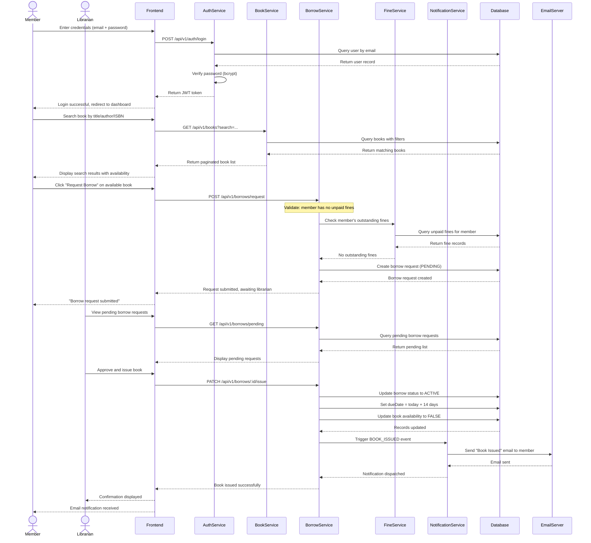
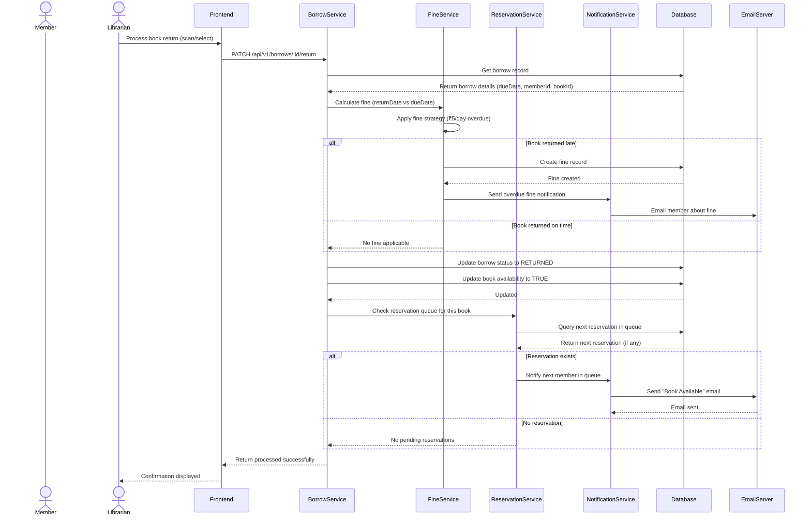

# Sequence Diagram — Library-Lite

## Main Flow: Member Borrows a Book (End-to-End)

This sequence diagram shows the complete flow from a member searching for a book to successfully borrowing it, including the librarian's role and system-side processing.

---

## Secondary Flow: Member Returns a Book

---

## Flow Summary

| Step | Actor | Action |
|---|---|---|
| 1 | Member | Login with JWT authentication |
| 2 | Member | Search books via catalog |
| 3 | Member | Submit borrow request |
| 4 | Librarian | Approve and issue book |
| 5 | System | Send email notification |
| 6 | Librarian | Process return |
| 7 | System | Calculate fine if overdue |
| 8 | System | Notify next member in reservation queue |
