# Use Case Diagram — Library-Lite

## Actors

| Actor | Description |
|---|---|
| **Guest** | Unauthenticated visitor (can browse catalog) |
| **Member** | Registered library member |
| **Librarian** | Staff managing books and borrowing |
| **Admin** | Full system access, manages users and reports |
| **System** | Automated background processes (fine calculation, notifications) |

---

## Use Case Diagram (Mermaid)

```mermaid
graph TD
    Guest((Guest))
    Member((Member))
    Librarian((Librarian))
    Admin((Admin))
    System((System))

    %% Guest Use Cases
    Guest --> UC1[Browse Book Catalog]
    Guest --> UC2[Search Books]
    Guest --> UC3[Register Account]
    Guest --> UC4[Login]

    %% Member Use Cases
    Member --> UC1
    Member --> UC2
    Member --> UC5[View My Borrowed Books]
    Member --> UC6[Reserve a Book]
    Member --> UC7[Cancel Reservation]
    Member --> UC8[View My Fines]
    Member --> UC9[View Notifications]
    Member --> UC10[Update Profile]

    %% Librarian Use Cases
    Librarian --> UC11[Issue Book to Member]
    Librarian --> UC12[Process Book Return]
    Librarian --> UC13[Add New Book]
    Librarian --> UC14[Update Book Details]
    Librarian --> UC15[Search Members]
    Librarian --> UC16[View Overdue Books]
    Librarian --> UC17[Mark Fine as Paid]

    %% Admin Use Cases
    Admin --> UC13
    Admin --> UC14
    Admin --> UC18[Delete Book]
    Admin --> UC19[Manage Users]
    Admin --> UC20[Assign Roles]
    Admin --> UC21[View Reports & Analytics]
    Admin --> UC22[Configure Fine Rules]

    %% System Use Cases
    System --> UC23[Auto-Calculate Overdue Fines]
    System --> UC24[Send Due Date Reminders]
    System --> UC25[Notify Next Member in Reservation Queue]
    System --> UC26[Expire Old Reservations]
```

---

## Use Case Descriptions

### UC1 — Browse Book Catalog
- **Actor**: Guest, Member
- **Description**: View paginated list of all books with title, author, genre, availability status
- **Precondition**: None
- **Postcondition**: Book list displayed

### UC6 — Reserve a Book
- **Actor**: Member
- **Description**: Member reserves a currently checked-out book; added to queue
- **Precondition**: Member logged in; book is not available
- **Postcondition**: Reservation created; member notified when book is returned

### UC11 — Issue Book to Member
- **Actor**: Librarian
- **Description**: Librarian scans/selects book and member; creates borrow record with due date
- **Precondition**: Book is available; member has no overdue fines
- **Postcondition**: Book marked as borrowed; due date set

### UC12 — Process Book Return
- **Actor**: Librarian
- **Description**: Librarian marks book as returned; system checks for overdue and calculates fine
- **Precondition**: Active borrow record exists
- **Postcondition**: Book available; fine created if overdue; next reservation notified

### UC23 — Auto-Calculate Overdue Fines
- **Actor**: System (scheduled job)
- **Description**: Daily cron job checks all active borrows past due date and creates/updates fine records
- **Precondition**: Borrow record past due date
- **Postcondition**: Fine record created/updated

### UC25 — Notify Next Member in Reservation Queue
- **Actor**: System
- **Description**: When a book is returned, system checks reservation queue and sends notification to next member
- **Precondition**: Book returned; reservation queue not empty
- **Postcondition**: Email/in-app notification sent to next member

---

## Relationships Summary

| Relationship | Type | Description |
|---|---|---|
| Member extends Guest | Generalization | Member inherits all Guest capabilities |
| Librarian extends Member | Generalization | Librarian can also do Member actions |
| Admin extends Librarian | Generalization | Admin has all Librarian + Admin capabilities |
| UC12 includes UC23 | Include | Return always triggers fine check |
| UC12 includes UC25 | Include | Return always checks reservation queue |
| UC11 extends UC6 | Extend | Issuing a book can auto-fulfill a reservation |
